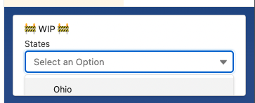
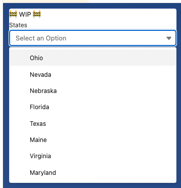

# Flow Runtime Escapist

Simply add this LWC to your `lightning__FlowScreen` LWC and it will eliminate the scrollable-y and slds card styles on the Flow Screen.

This is specifically for Flow Screens opened in Console Applications. Flow Screens opened in another context, such as a Standard Application should not use this component.

Before using Flow Runtime Escapist

After using Flow Runtime Escapist
